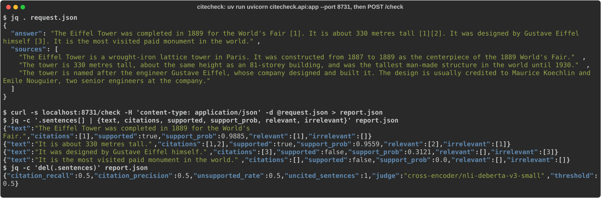

# citecheck

> **Credits.** Built by Amaan Mithani with Claude (Anthropic) as the AI coding assistant.

Do the citations in a generated answer actually support its sentences? Work in progress; see [docs/SPEC.md](docs/SPEC.md).

## See it running

A real run: the API server (`uv run uvicorn citecheck.api:app --port 8731`) scoring a four-sentence sample answer against three sources with the default NLI judge (`cross-encoder/nli-deberta-v3-small`, CPU, threshold 0.5). It marks "designed by Gustave Eiffel himself" as unsupported (source [3] credits Koechlin and Nouguier), citation [1] as irrelevant to the height claim, and the last sentence as uncited.
